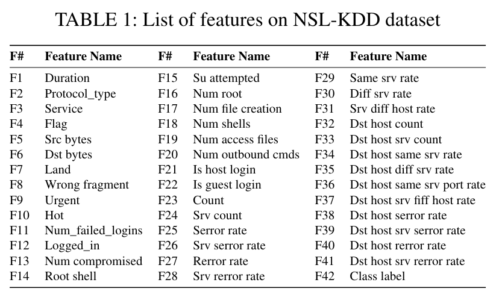
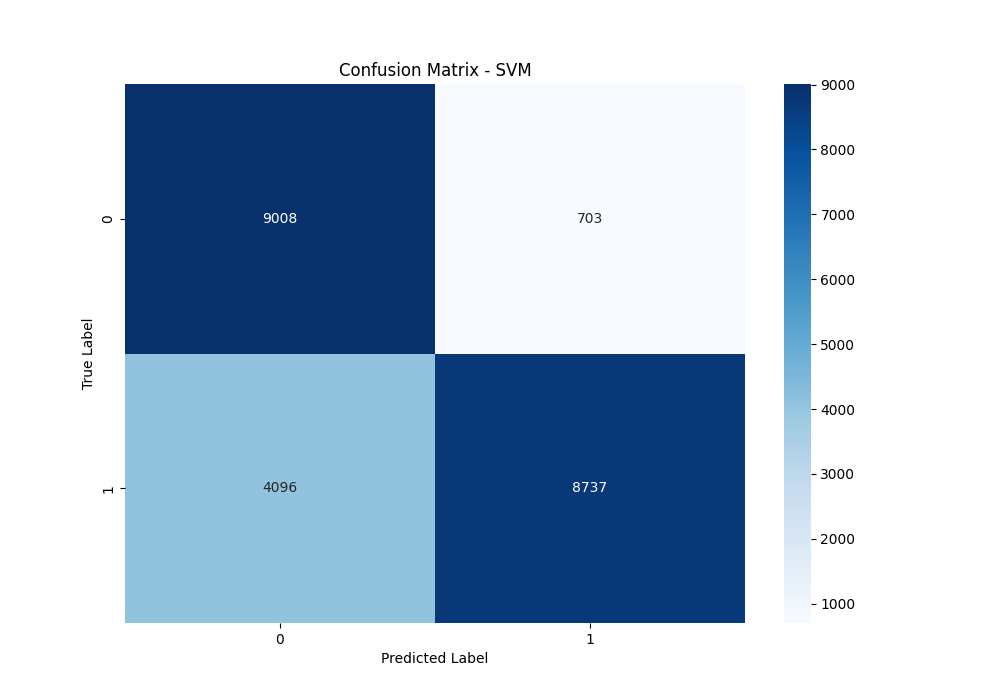
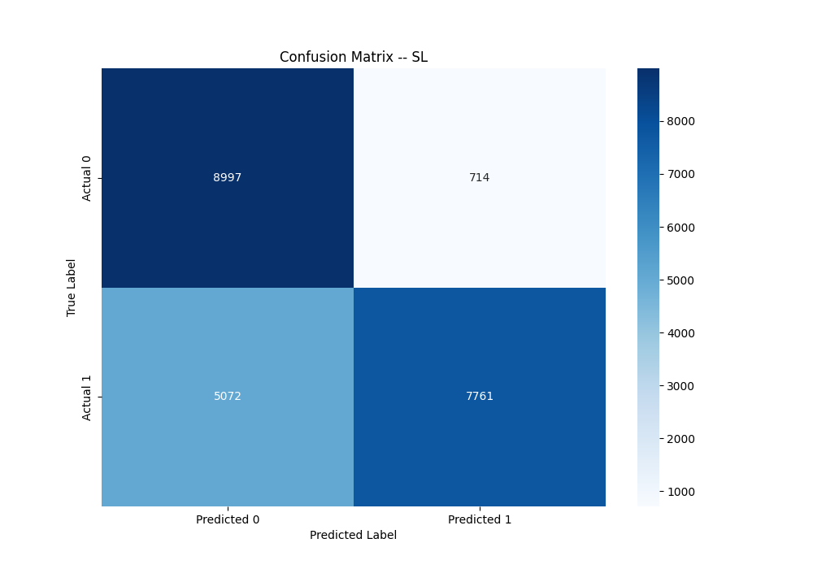
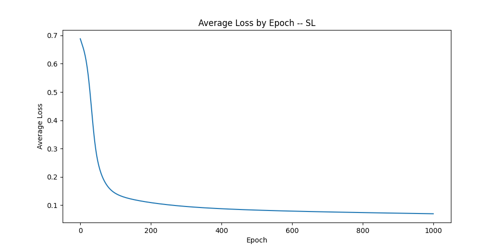
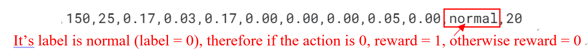

# Different Machine Learning Methods on Classification Problem
在这个项目里面，我们将使用监督学习，非监督学习（SVM）,强化学习（深度Q学习和演员评论家算法），用于NSL KDD数据集上进行分类问题，并到探索其的优缺点。

The NSL-KDD dataset consists of network traffic data collected from a simulated computer network environment. The network traffic includes both normal and various types of attack activities. The dataset provides a diverse range of intrusion scenarios, making it suitable for evaluating the performance of intrusion detection systems.

In this study, we used the pre-processed and normalized NSL-KDD dataset as the environment. The columns (features) of the NSL-KDD dataset were used as the states for the DQN. The dataset contains a total of 42 features, and we used the first 41 features as states. The 42nd feature is the label used for computing the reward vector based on model predictions [2]. 



总的来说，这些方法在nsl-kdd上均可以得到较多的TP和TN,以及较少对的FP,但是均有较大的FN. 目前的epoch测试在500-1000左右。目前的改进方法在于是否提升hidden network的数量和layer的层数，以及epoch是否够，因为nsl_kdd数据库有40多个attrubute.

总体来说。几个模型的结果接近。Accuracy和F1大体为0.78-0.82， 召回率为0.68-0.72， 精确度则高达0.93-0.95，这表明在模型预测为阳性的数据中，实际是阳性的正确率较高，然而模型还是存在漏掉真正阳性将其判断成阴性，还需要按照上面说的几点进行改正

大致的效果（同种参数下：例如hidden layer=100, epoch=1000,学习率=0.1相同时），训练情况为SVM>DQN大于等于演员评论家大于等于监督学习。当且随着epoch的增加，在一定程度上模型表现会变好，但仍有局限性

1. 非监督学习方法
我们就用的最简单的SVM method。
最后得出在test data上面的结果如下


2. 监督学习方法
用的是逻辑回归
用的SGC优化器和CrossEntropyLoss



3. 强化学习方法
(1)状态：NSL-KDD的前41个features,个数非常多
(2)动作：两个。The actions represented two possibilities: action 1 denoting an anomaly, and action 0 denoting normal behavior. 由强化学习方法进行动作的选取（随机选择/Q表的最大值等等）
   
(3)奖励：与NSL-KDD数据集的最后一个features进行比对.If the action matched the corresponding label value, the agent received a reward of 1; otherwise, the reward was 0.
      `R(s, a)` is defined as:
      
      ```latex
      R(s, a) = \begin{cases} 
      1 & \text{if action = labels} \\
      0 & \text{otherwise}
      \end{cases}

(4) 状态转移
无严格的状态转移方程，就按照数据库里的数据从上到下依次训练即可（例如St为第i行的数据，则St+1为第i+1行的数据）

(5) 两个方法
### Deep Q-Learning (DQN) and Actor-Critic Methods Explained

#### a. Deep Q-Learning (DQN)

Deep Q-Learning integrates the classic Q-learning technique with deep neural networks, enabling the handling of high-dimensional state spaces.

##### Key Components
- **Reward Function**: This function defines the rewards given to the agent based on its actions and the resulting state changes.
- **Loss Function**: Typically, DQN uses the mean squared error of the difference between the current predicted Q-values and the target Q-values.
- **Network Structure**: Consists of a deep neural network that approximates the Q-value function, often structured with multiple hidden layers.

##### Formulas and Functions
- **Q-value Update Rule**:
  \[
  Q(s_t, a_t) \leftarrow Q(s_t, a_t) + \alpha \left(r_{t+1} + \gamma \max_{a}Q(s_{t+1}, a) - Q(s_t, a_t)\right)
  \]
- **Action Selection**: In DQN, action selection is managed by an ε-greedy policy, which mixes exploration and exploitation to improve learning. The exploration rate is dynamically adjusted as follows:
  \[
  \text{exploration} = \text{decay\_rate}^{(\text{epoch} / 5)}
  \]
  This lets the exploration rate decrease as the number of epochs increases, leading to a better balance of exploration and exploitation.
  
  Actions are then chosen based on:
  \[
  a_t = \begin{cases} 
  \text{random action} & \text{with probability } \epsilon \\
  \arg\max_a Q(s_t, a) & \text{with probability } 1-\epsilon
  \end{cases}
  \]
- **Loss Function**:
  \[
  \text{Loss} = \left(r + \gamma \max_{a'}Q(s', a') - Q(s, a)\right)^2
  \]

#### b. Actor-Critic

Actor-Critic methods use two models: one to generate the policy (actor) and another to evaluate actions (critic).

##### Key Components
- **Reward Function**: Rewards are given based on the results of actions, similar to DQN.
- **Loss Functions**:
  - **Actor Loss**: Optimizes the policy network using policy gradients.
  - **Critic Loss**: Updates the value network using the temporal difference (TD) error.
- **Network Structures**:
  - **Actor Network**: Outputs a probability distribution over possible actions.
  - **Critic Network**: Outputs a value estimating the expected return from the current state.

##### Formulas and Functions
- **Action Function (Actor)**:
  \[
  \pi(a|s, \theta) \text{, where }\theta \text{ are the parameters of the actor network}
  \]
- **Value Function (Critic)**:
  \[
  V^\pi(s) \text{, approximated by the critic network}
  \]
- **Actor Loss**:
  \[
  L(\theta) = -\log(\pi(a|s, \theta)) \cdot A(s, a)
  \]
  Where \( A(s, a) \) is the advantage function, computed as \( r + \gamma V(s') - V(s) \).
- **Critic Loss**:
  \[
  L(w) = \left(r + \gamma V(s', w) - V(s, w)\right)^2
  \]
  Where \( w \) are the parameters of the critic network.

These methods provide robust frameworks for solving complex reinforcement learning problems, particularly in environments with large or continuous state and action spaces. The result with different epoch are shown in the folder attached
